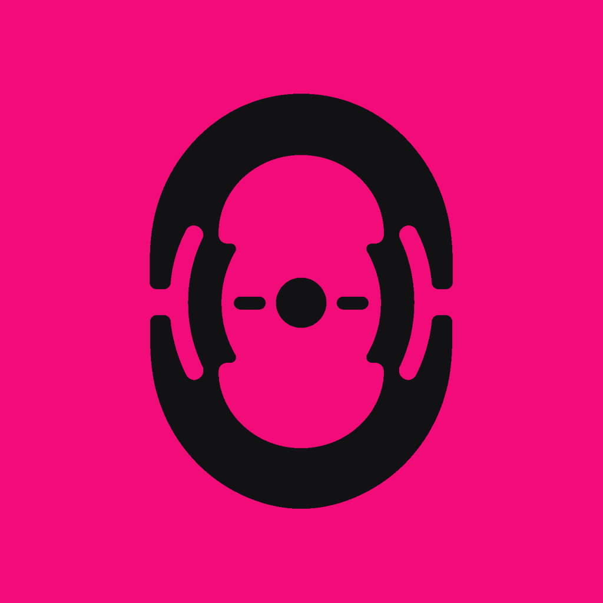

<p align="center">
  
</p>

<h1 align="center">Ech0</h1>

<p align="center">
  Use the microphone connected to your Windows PC as a native audio input on a remote Mac.
</p>

<p align="center">
  <a href="https://github.com/Netscale1/Ech0/actions/workflows/ci.yml"></a>
  <a href="https://github.com/Netscale1/Ech0/releases/latest"></a>
  <a href="LICENSE"></a>
</p>

Ech0 is an open-source, local-network microphone bridge for a specific remote
desktop problem: the Mac is the computer running the voice application, while
the microphone and headphones are physically connected to the Windows PC from
which the Mac is being controlled.

It consists of a lightweight Windows tray agent, a native macOS receiver, and
an input-only macOS virtual microphone. When a Mac application opens that
microphone, Ech0 starts capture on Windows, transports the audio over an
authenticated and encrypted LAN connection, and exposes it to macOS like a
regular input device.

## Why Ech0 exists

Our setup uses Parsec to control a Mac from a Windows PC. Parsec already handles
the desktop, controls, and Mac playback very well. The missing path was the
other direction:

```text
microphone connected to Windows -> application running on the Mac
```

At the time of this release, Parsec's
[microphone passthrough documentation](https://support.parsec.app/hc/en-us/articles/32380350695956-Use-your-Microphone-with-Parsec)
supports sending a Windows or macOS client microphone to a **Windows host**.
Its current [host feature matrix](https://support.parsec.app/hc/en-us/articles/32381463419924-Feature-Matrix)
lists microphone support for Windows hosts, but not macOS hosts. Ech0 fills that
particular gap; it does not replace Parsec or attempt to be another remote
desktop application.

The goal sounds simple, but the audio topology matters. It is not enough to
make the Windows microphone audible somewhere on the Mac. The signal must
arrive as a microphone input for the target application without also entering
the Mac playback path that Parsec sends back to Windows.

## Why not just use BlackHole?

[BlackHole](https://github.com/ExistentialAudio/BlackHole) is an excellent
open-source macOS loopback driver. It routes audio between applications on the
same Mac, but it does not capture a microphone on another computer or transport
that audio over the network. A sender and receiver are still required.

Early Ech0 versions wrote the received microphone audio into `BlackHole 2ch`.
That works as a general-purpose compatibility route, but in our Parsec setup
the same loopback/output topology could also be part of host-audio capture. The
microphone could therefore return to the Windows side together with Mac
playback—the exact feedback path we wanted to avoid.

This is not a defect in BlackHole or Parsec. It is a consequence of asking one
loopback device to participate in two different routes. Ech0 now ships its own
`Ech0 Virtual Microphone`, designed with input channels and **no output
channels**. macOS applications can record from it, while playback and Parsec's
audio route remain independent.

BlackHole remains an optional fallback for systems where the dedicated driver
cannot be installed. Ech0 no longer requires it and only changes its sample
rate when it is actually selected as the fallback.

## How it works

```text
macOS application opens Ech0 Virtual Microphone
                    |
                    v
        Ech0Mac detects input demand
                    |
          encrypted control message
                    |
                    v
  Ech0Windows opens the selected WASAPI microphone
                    |
          encrypted 48 kHz PCM over TCP
                    |
                    v
       Ech0Mac -> Ech0 Virtual Microphone
                    |
                    v
          requesting macOS application
```

The Windows agent stays connected while idle, but it does not keep the physical
microphone open continuously. Capture starts only when a Mac process actively
uses the selected Ech0 input, and stops when that demand ends. A manual capture
control is available for diagnostics.

The first pairing uses a copyable security code. Later connections authenticate
the saved sender and receiver identities. Protocol v3 uses ephemeral P-256 key
agreement, HKDF-SHA256, and directional AES-256-GCM protection for credentials,
control traffic, and audio. Ech0 is still intended for a trusted local network;
it does not provide an Internet relay and port `48484/TCP` should not be exposed
directly to the public Internet.

## What Ech0 provides

- Native Windows x64 tray agent using .NET 10, NAudio, and WASAPI shared mode
- Native Apple Silicon macOS receiver using SwiftUI, Network.framework, and Core Audio
- Dedicated input-only `Ech0 Virtual Microphone`
- Automatic DNS-SD discovery, with manual host configuration as a fallback
- Demand-driven capture instead of an always-open Windows microphone
- Authenticated, encrypted transport and trusted reconnect after pairing
- Local jitter buffering and a voice-oriented 48 kHz audio path
- Copyable, privacy-redacted diagnostics with versions, audio state, metrics, and RTT
- Optional compatibility fallback to an existing `BlackHole 2ch` installation

## Requirements

- Windows 10 22H2 or Windows 11, x64
- Apple Silicon Mac running macOS 13 or later
- Both computers on the same trusted local network
- Administrator approval when installing the macOS virtual microphone driver

Version 0.2.0 community binaries are not backed by commercial signing
credentials. The macOS package is ad-hoc signed but not Apple-notarized; the
Windows executable is not Authenticode-signed and may trigger SmartScreen. The
source, tests, checksums, and credential-free release scripts are public so the
artifacts can be inspected and reproduced.

## Quick start

1. Download both platform archives from the
   [latest GitHub release](https://github.com/Netscale1/Ech0/releases/latest).
2. On the Mac, verify the published checksum, extract the community archive,
   and read its `INSTALL.md` before installing `Ech0Mac.app` and
   `Ech0VirtualMic.driver`.
3. On Windows, verify `SHA256SUMS`, extract `Ech0Windows-win-x64.zip`, and run
   `Ech0Windows.exe`. The self-contained executable does not require a separate
   .NET installation or administrator rights.
4. Start Ech0Mac. Let the Windows agent discover it automatically, or enter the
   Mac hostname or IP address and port `48484` manually.
5. Copy the pairing code displayed by Ech0Mac into the Windows pairing window.
6. Set `Ech0 Virtual Microphone` as the input in the target Mac application, or
   use Ech0Mac to make it the system input.

Once paired, the Windows agent can launch at sign-in and reconnect while idle.
Opening the virtual microphone on the Mac activates Windows capture
automatically.

For complete installation, permissions, fallback, and verification steps, see
[Setup notes](docs/setup.md) and the
[Windows-to-Mac guide](docs/windows-codex-setup.md).

## Scope and non-goals

Ech0 is deliberately a focused utility rather than a general audio workstation.
Version 0.2.0 supports:

- one Windows sender and one macOS receiver at a time;
- one selected Windows capture endpoint;
- local-network transport without a cloud service;
- live microphone delivery, not recording or file transfer;
- an input-only Mac endpoint, not system-audio or speaker streaming.

## Build and verify

The macOS gate runs the Swift tests, Release build, signature and bundle checks,
and an input-only HAL smoke test without installing the driver or changing the
computer's audio routes:

```sh
./scripts/macos-release.sh check
```

The Windows gate requires the .NET 10 SDK and runs the test suite before
producing an unsigned self-contained x64 package:

```powershell
./scripts/release-windows.ps1 -AllowUnsignedDevelopment
```

See [macOS release engineering](docs/macos-release.md),
[Windows release engineering](docs/release.md), and the
[protocol specification](docs/protocol.md) for the complete reproducible paths.

## Repository guide

- `macos/`: SwiftUI receiver, Core Audio integration, tests, and virtual microphone driver
- `windows/`: WinForms tray agent, WASAPI capture, secure transport, and tests
- `scripts/`: test-first build, validation, signing, and packaging entry points
- `docs/macos-audio-bridge.md`: architecture, Parsec isolation, and measured performance work
- `docs/protocol.md`: transport, pairing, control, and audio-frame specification
- `docs/review-findings.md`: historical engineering evidence, not current requirements

## Contributing and security

Focused contributions are welcome. Read [CONTRIBUTING.md](CONTRIBUTING.md)
before changing the protocol, audio topology, pairing, or release formats.
Report suspected vulnerabilities privately as described in
[SECURITY.md](SECURITY.md), not in a public issue.

Ech0 is an independent project and is not affiliated with Parsec or the
BlackHole project.

## License

Ech0 is licensed under the [Apache License 2.0](LICENSE). The Ech0 name and logo
are not granted for use as branding for modified distributions. Third-party
components retain their own licenses; see
[THIRD_PARTY_NOTICES.md](THIRD_PARTY_NOTICES.md).
